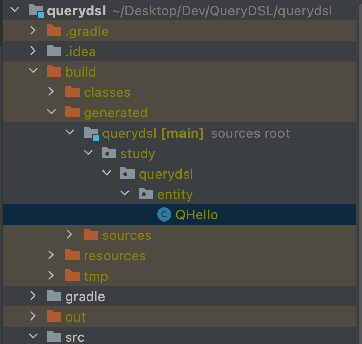

# 프로젝트 환경설정

## 프로젝트

- groupId : study
- artifactId: querydsl
- dependencies
  - spring web
  - jpa
  - h2
  - lombok

</br>

## QueryDsl 설정과 검증

</br>

```gradle

buildscript {
    ext {
        queryDslVersion = "5.0.0"
    }
}

plugins {
    id 'org.springframework.boot' version '2.7.0'
    id 'io.spring.dependency-management' version '1.0.11.RELEASE'

    id "com.ewerk.gradle.plugins.querydsl" version "1.0.10"
    id 'java'
}

group = 'study'
version = '0.0.1-SNAPSHOT'
sourceCompatibility = '17'

configurations {
    compileOnly {
        extendsFrom annotationProcessor
    }
}

repositories {
    mavenCentral()
}

dependencies {
    implementation 'org.springframework.boot:spring-boot-starter-data-jpa'
    implementation 'org.springframework.boot:spring-boot-starter-web'

    //querydsl 추가
    implementation "com.querydsl:querydsl-jpa:${queryDslVersion}"
    annotationProcessor "com.querydsl:querydsl-apt:${queryDslVersion}"

    implementation 'org.projectlombok:lombok:1.18.20'
    compileOnly 'org.projectlombok:lombok'
    annotationProcessor 'org.projectlombok:lombok'

    //테스트에서 lombok 사용
    testCompileOnly 'org.projectlombok:lombok'
    testAnnotationProcessor 'org.projectlombok:lombok'

    runtimeOnly 'com.h2database:h2'
    testImplementation 'org.springframework.boot:spring-boot-starter-test'
}

tasks.named('test') {
    useJUnitPlatform()
}

//querydsl 추가 시작
def querydslDir = "$buildDir/generated/querydsl"

querydsl {
    jpa = true
    querydslSourcesDir = querydslDir
}
sourceSets {
    main.java.srcDir querydslDir
}
configurations {
    querydsl.extendsFrom compileClasspath
}
compileQuerydsl {
    options.annotationProcessorPath = configurations.querydsl
}

```

</br>

- QueryDsl 테스트용 엔티티

```java

@Entity
@Setter
@Getter
public class Hello {

    @Id
    @GeneratedValue
    private Long id;
}
```

</br>

|                 compile                 |
| :-------------------------------------: |
|  |

</br>

|                 build                 |
| :-----------------------------------: |
|  |

</br>

```java
import static com.querydsl.core.types.PathMetadataFactory.*;

import com.querydsl.core.types.dsl.*;

import com.querydsl.core.types.PathMetadata;
import javax.annotation.processing.Generated;
import com.querydsl.core.types.Path;


/**
 * QHello is a Querydsl query type for Hello
 */
@Generated("com.querydsl.codegen.DefaultEntitySerializer")
public class QHello extends EntityPathBase<Hello> {

    private static final long serialVersionUID = 1910216155L;

    public static final QHello hello = new QHello("hello");

    public final NumberPath<Long> id = createNumber("id", Long.class);

    public QHello(String variable) {
        super(Hello.class, forVariable(variable));
    }

    public QHello(Path<? extends Hello> path) {
        super(path.getType(), path.getMetadata());
    }

    public QHello(PathMetadata metadata) {
        super(Hello.class, metadata);
    }

}
```

</br>

> 컴파일 할 경우 Entity를 찾아와서  
> 타입을 만들어주는 것을 알 수 있다.

</br>

## 라이브러리 살펴보기

</br>

- querydsl-apt: Querydsl 관련 코드 생성 기능 제공
- querydsl-jpa: querydsl 라이브러리

</br>

## h2 데이터베이스 설치

</br>

## 스프링 부트 설정 - JPA, DB

</br>

```yml
spring:
  datasource:
    url: jdbc:h2:tcp://localhost/~/querydsl
    username: sa
    password:
    driver-class-name: org.h2.Driver
  jpa:
    hibernate:
      ddl-auto: create
    properties:
      hibernate:
        format_sql: true
  logging.level:
    org.hibernate.SQL: debug
```

</br>
