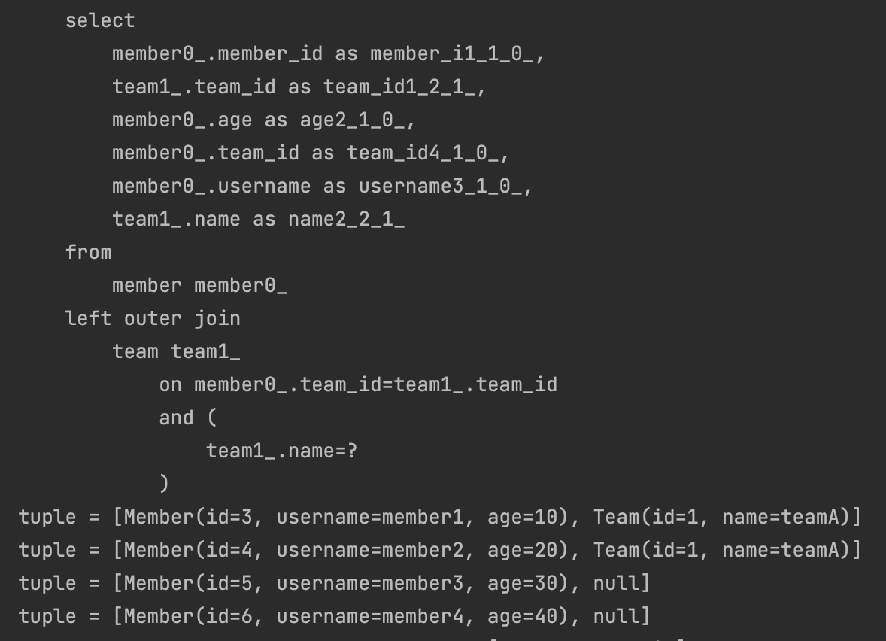

# 기본 문법

</br>

## 시작 - JPQL vs Querydsl

</br>

```java
    @Test
    void startJPQL(){

        String qlString = "select m from Member m where m.username = :username";

        Member findMember = em.createQuery(qlString, Member.class)
                .setParameter("username", "member1")
                .getSingleResult();

        assertThat(findMember.getUsername()).isEqualTo("member1");
    }

    @Test
    public void startQueyrdsl(){
        JPAQueryFactory queryFactory = new JPAQueryFactory(em);
        QMember m = new QMember("m");

        Member findMember = queryFactory
                .selectFrom(m)
                .from(m)
                .where(m.username.eq("member1"))
                .fetchOne();

        assertThat(findMember.getUsername()).isEqualTo("member1");
    }
```

> 동일한 검색결과를 보장해준다.  
> QueryDsl에서 파라미터 바인딩을 안하고 있는데,  
> 이렇게 하지 않아도 자동으로 preparedStatement로 만들어서  
> 바인딩 해준다!

</br>

- 가장 큰 차이점
  - qlString이 잘못될 경우 애플리케이션이 로딩 되는 시점에 예외가 터진다.
  - QueyrDsl은 Qtype으로 컴파일 시점에 예외를 발생시킨다.
    - 직접 String으로 작성 안해도 된다.

> JPAQueyrFactor를 필드로 제공하면 동시성 문제는 EntityManager에 달려 있다.  
> 즉 여러 쓰레드에서 EntityManager를 사용한다 할 지라도.  
> 트랜잭션 마다 별도의 영속성 컨텍스트를 갖기 때문에, 동시성 이슈 문제에 관해서 괜찮다.

</br>

## 기본 Q-Type 활용

</br>

```java
QMember qMember = new QMember("m");
QMember qMember = QMember.member;
```

- 같은 테이블 조인하는 경우 아니면 기본 인스턴스를 사용

</br>

## 검색 조건 쿼리

</br>

```java
    @Test
    public void search(){
        Member findMember = queryFactory.selectFrom(member)
                .where(member.username.eq("member1")
                        .and(member.age.eq(10)))
                .fetchOne();
        assertThat(findMember.getUsername()).isEqualTo("member1");
    }

    @Test
    public void search(){
        Member findMember = queryFactory.selectFrom(member)
                .where(member.username.eq("member1"),
                        .member.age.eq(10))
                .fetchOne();
        assertThat(findMember.getUsername()).isEqualTo("member1");
    }
```

- and(), or()를 체이닝으로 사용 가능
- and 조건만 있을 경우 ,로 연결 가능

- 모든 검색 조건 제공

```java
  ne(), eq().not() : !=
  isNotNull() // is not null

  in()
  notIn()
  between()

  goe(30) // age >= 30
  gt(30) // age > 30
  loe(30) // age <= 30
  lt(30) // age < 30

  like("member%")
  contains("member") // %like%
  startsWith("member") // "member%"
```

</br>

</br>

## 결과 조회

</br>

- fetch() : 리스트 조회, 데이터 없으면 빈 리스트
- fetchOne()
  - 단 건 조회
  - 결과가 없으면 : null
  - 결과가 둘 이상이면 : com.querydsl.core.NonUniqueResultException
- fetchFirst() : limit(1).fetchOne()
- fetchResults() : 페이징 정보 포함, total count 쿼리 추가 실행
- fetchCount() : count 쿼리로 변경해서 count 수 조회

</br>

```java
@Test
    public void resultFetch(){

        // 리스트 조회
        List<Member> members = queryFactory
                .selectFrom(member)
                .fetch();

        // 단건 조회
        Member member1 = queryFactory
                .selectFrom(member)
                .where(member.username.eq("member1"))
                .fetchOne();

        // limit(1).fethOne()
        Member member2 = queryFactory
                .selectFrom(member)
                .fetchFirst();

        // fetchResults
        QueryResults<Member> results = queryFactory
                .selectFrom(member)
                .fetchResults();


        results.getTotal();
        List<Member> content = results.getResults();

        // Depreciated
        // fetchCount()
        long count = queryFactory
                .selectFrom(member)
                .fetchCount();

        // fetchCount()
        long count = queryFactory
                .select(member.count())
                .from(member)
                .fetchOne();
    }

```

</br>

## 정렬

</br>

```java
@Test
    /**
     * 회원 정렬 순서
     * 1. 나이 내림차순
     * 2. 이름 올림차순
     * 3. 단 2에서 회원 이름이 없으면 마지막에 출력(nulls last)
     * */
    void sort(){
        em.persist(new Member(null, 100,null));
        em.persist(new Member("member5", 100, null));
        em.persist(new Member("member6", 100, null));

        List<Member> members = queryFactory
                .selectFrom(member)
                .where(member.age.eq(100))
                .orderBy(
                        member.age.desc(),
                        member.username.asc()
                                .nullsLast()
                )
                .fetch();

        Member member5 = members.get(0);
        Member member6 = members.get(1);
        Member memberNull = members.get(2);
        assertThat(member5.getUsername()).isEqualTo("member5");
        assertThat(member6.getUsername()).isEqualTo("member6");
        assertThat(memberNull.getUsername()).isNull();
    }
```

- orderBy() 제공
  - desc() , asc()
  - nullsLast(), nullsFirst() : null 데이터 순서 부여

</br>

## 페이징

</br>

```java
    @Test
    public void paging1(){
        List<Member> result = queryFactory
                .selectFrom(member)
                .orderBy(member.username.desc())
                .offset(1)
                .limit(2)
                .fetch();

        assertThat(result.size()).isEqualTo(2);
    }

```

- offset과 limit를 이용해서 paging 처리

</br>

## 집합

</br>

```java
@Test
    public void aggregation(){
        List<Tuple> result = queryFactory
                .select(
                        member.count(),
                        member.age.sum(),
                        member.age.avg(),
                        member.age.max(),
                        member.age.min()
                )
                .from(member)
                .fetch();

        Tuple tuple = result.get(0);
        assertThat(tuple.get(member.count())).isEqualTo(4);
        assertThat(tuple.get(member.age.sum())).isEqualTo(100);
        assertThat(tuple.get(member.age.avg())).isEqualTo(25);
        assertThat(tuple.get(member.age.max())).isEqualTo(40);
        assertThat(tuple.get(member.age.min())).isEqualTo(10);
    }
```

</br>

> data type이 여러개여서 Tuple로 반환한다.

</br>

- group by 사용

```java
/**
     * 팀의 이름과 각 팀의 평균 연령을 구해라.
     * */
    @Test
    public void groupBy(){
        List<Tuple> result = queryFactory
                .select(team.name, member.age.avg())
                .from(member)
                .join(member.team, team)
                .groupBy(team.name)
                .fetch();

        Tuple teamA = result.get(0);
        Tuple teamB = result.get(1);
        assertThat(teamA.get(team.name)).isEqualTo("teamA");
        assertThat(teamA.get(member.age.avg())).isEqualTo(15);
        assertThat(teamB.get(team.name)).isEqualTo("teamB");
        assertThat(teamB.get(member.age.avg())).isEqualTo(35);
    }
```

</br>

## 조인 - 기본 조인

</br>

```java
/**
     * 팀 A에 소속된 모든 회원
     */
    @Test
    public void join(){
        List<Member> result = queryFactory
                .selectFrom(member)
                .join(member.team, team)
                .where(team.name.eq("teamA"))
                .fetch();

        assertThat(result)
                .extracting("username")
                .containsExactly("member1","member2");

    }

```

- join(), innerJoin(): 내부 조인
- leftJoin(): left 외부 조인
- rightJoin(): right 외부 조인(right outer join)
- JPQL의 on과 성능 최적화를 위한 fetch 조인 제공 -> 다음 on 절에서 설명

- -theta join

```java
    @Test
    public void theta(){
        em.persist(new Member("teamA",100, null));
        em.persist(new Member("teamB",100, null));

        List<Member> result = queryFactory
                .select(member)
                .from(member, team)
                .where(member.username.eq(team.name))
                .fetch();

        assertThat(result)
                .extracting("username")
                .containsExactly("teamA", "teamB");
    }
```

> 연관관계가 없는 member의 이름과 team의 이름을 join할 수 있다.  
> `outer join이 불가능 하다`  
> join on을 사용하면 외부 조인 사용 가능

</br>

## 조인 - on절

</br>

- 조인 대상을 필터링

```java
/**
     * 예) 회원과 팀을 조인하면서, 팀 이름이 teamA인 팀만 조인, 회원은 모두 조회
     * JPQL: SELECT m, t FROM Member m LEFT JOIN m.team t on t.name = 'teamA'
     * SQL: SELECT m.*, t.* FROM Member m LEFT JOIN Team t ON m.TEAM_ID=t.id and
     t.name='teamA'
     */
    @Test
    public void join_on_filtering() throws Exception {
        List<Tuple> result = queryFactory
                .select(member, team)
                .from(member)
                .leftJoin(member.team, team).on(team.name.eq("teamA"))
                .fetch();
        for (Tuple tuple : result) {
            System.out.println("tuple = " + tuple);
        }
    }
```

</br>

|                   결과                   |
| :--------------------------------------: |
|  |

</br>

```java
.join(member.team, team).on(team.name.eq("teamA"))

.join(member.team, team)
.where(team.name.eql("teamA"))
```

- on절을 활용해 조인 대상을 필터링 할 때, `외부 조인이 아니라 내부 조인을 사용하면, where절에서 필터링 하는 것과 동일.`
- on 절을 활용한 조인 대상 필터링을 시작할 때,
  - 내부 조인이면 `익숙한 where절로 해결`
  - 정말 외부 조인이 필요한 경우에만 `외부조인 사용`

</br>

- 연관 관계 없는 엔티티를 외부조인
  - 세타 조인은 아우터조인이 안되기 때문에 이를 스프링부트 2.1부터 지원

```java

/**
*2. 연관관계 없는 엔티티 외부 조인
*예)회원의 이름과 팀의 이름이 같은 대상 외부 조인
* JPQL: SELECT m, t FROM Member m LEFT JOIN Team t on m.username = t.name
* SQL: SELECT m.*, t.* FROM Member m LEFT JOIN Team t ON m.username = t.name */
    @Test
    public void join_on_no_relation() throws Exception {
        em.persist(new Member("teamA"));
        em.persist(new Member("teamB"));
        List<Tuple> result = queryFactory
                .select(member, team)
                .from(member)
                .leftJoin(team).on(member.username.eq(team.name))
                .fetch();
        for (Tuple tuple : result) {
            System.out.println("t=" + tuple);
        }
    }
```

- leftJoin() 파라미터에 일반 조인과 다르게 엔티티 하나만 들어간다.

</br>

## 조인 - fetch 조인

</br>

- SQL 조인을 활용 하여 연관된 엔티티를 쿼리 한 번에 조회하는 기능
- 주로 성능 최적화에 사용하는 방법

</br>

- fetch join 미적용

```java
@Test
    public void fetchJoinNo() throws Exception {
        em.flush();
        em.clear();

        Member findMember = queryFactory
                .selectFrom(member)
                .where(member.username.eq("member1"))
                .fetchOne();

        boolean loaded =
                emf.getPersistenceUnitUtil().isLoaded(findMember.getTeam());

        assertThat(loaded).as("페치 조인 미적용").isFalse();
    }
```

|                  페치 조인 미적용 결과                  |
| :-----------------------------------------------------: |
|  |

> 먼저 member 정보에 대한 쿼리만 실행되고  
> Team의 메서드가 로드 되지 않은 것을 확인할 수 있다.(지연 로딩)

</br>

```java
   @Test
    public void fetchJoinUse() throws Exception {
        em.flush();
        em.clear();

        Member findMember = queryFactory
                .selectFrom(member)
                .join(member.team, team).fetchJoin()
                .where(member.username.eq("member1"))
                .fetchOne();

        boolean loaded =
                emf.getPersistenceUnitUtil().isLoaded(findMember.getTeam());
        assertThat(loaded).as("페치 조인 적용").isTrue();
    }

```

|                페치 조인 적용 결과                 |
| :------------------------------------------------: |
|  |

> join()으로 join 지정 해주고, fetchJoin()으로 부르기
> `inner join으로 팀의 정보까지 한 번에 불러오는 것을 알 수 있다.`

</br>

## 서브 쿼리

- com.querydsl.jpa.JPAExpressions 사용

</br>

- 서브 쿼리 eq 사용

```java
/**
     * 나이가 가장 많은 회원 조회
     * 회  *
     */
    @Test
    public void suQuery() {
        QMember memberSub = new QMember("memberSub");
        List<Member> result = queryFactory
                .selectFrom(member)
                .where(member.age.eq(
                        JPAExpressions
                                .select(memberSub.age.max())
                                .from(memberSub)
                )).fetch();
        assertThat(result).extracting("age")
                .containsExactly(40);

    }

```

</br>

- 서브 쿼리 goe 사용

```java
/**
     * 나이가 평균 나이 이상인 회원
     */
    @Test
    public void subQueryGoe() throws Exception {
        QMember memberSub = new QMember("memberSub");
        List<Member> result = queryFactory
                .selectFrom(member)
                .where(member.age.goe(
                        JPAExpressions
                                .select(memberSub.age.avg())
                                .from(memberSub)
                )).fetch();
        assertThat(result).extracting("age")
                .containsExactly(30, 40);
    }
```

</br>

- 서브쿼리 여러 건 처리 in 사용

```java

/**
     * 서브쿼리 여러 건 처리, in 사용
     */
    @Test
    public void subQueryIn() throws Exception {
        QMember memberSub = new QMember("memberSub");
        List<Member> result = queryFactory
                .selectFrom(member)
                .where(member.age.in(
                        JPAExpressions
                                .select(memberSub.age)
                                .from(memberSub)
                                .where(memberSub.age.gt(10))
                )).fetch();

        assertThat(result).extracting("age")
                .containsExactly(20, 30, 40);


        // select절에 sub쿼리

        List<Tuple> fetch = queryFactory
                .select(member.username,
                        JPAExpressions
                                .select(memberSub.age.avg())
                                .from(memberSub)
                ).from(member)
                .fetch();

        for (Tuple tuple : fetch) {
            System.out.println("username = " + tuple.get(member.username));
            System.out.println("age = " +
                    tuple.get(JPAExpressions.select(memberSub.age.avg())
                            .from(memberSub)));
        }
    }

```

</br>

- static import 활용

```java
List<Member> result = queryFactory
            .selectFrom(member)
            .where(member.age.eq(
                    select(memberSub.age.max())
                            .from(memberSub)
            )) .fetch();
```

</br>

### from 절의 서브 쿼리 한계

</br>

- JPA JPQL 서브쿼리의 한계로 from의 서브쿼리(인라인 뷰)를 지원하지 않는다.
  - 당연히 QueryDsl도 지원하지 않는다.
- 하이버네이트 구현체를 사용하려면 select 절의 서브쿼리는 지원한다.
  - Querydsl도 하이버네이트 구현체를 사용하면 select 서브쿼리를 지원

</br>

### from절의 해결 방안

- 서브쿼리를 join으로 변경한다.
- 애플리케이션에서 쿼리를 2번 분리해서 실행
- native 쿼리

</br>

> 실시간 트래픽이 중요한 경우에는 쿼리 하나하나가 아쉬울 수 있지만,  
> 애플리케이션에서는 로직이 중요하기 때문에 고민을 해봐야한다.
> 베스트는 join으로 해결하려고 노력해야한다.

</br>

## Case 문

- select
- where
- order by 에서 사용

</br>

- 단순한 조건

</br>

</br>

```java
    @Test
    public void basicCase() {

        List<String> result = queryFactory.select(
                        member.age
                                .when(10).then("열살")
                                .when(10).then("열살")
                                .otherwise("기타")
                        )
                        .from(member)
                        .fetch();

        result.forEach(System.out::println);
    }
```

</br>

- 복잡한 조건

</br>

```java
    @Test
    public void complexCase(){

        List<String> result = queryFactory
                .select(new CaseBuilder()
                        .when(member.age.between(0, 20)).then("0~20살")
                        .when(member.age.between(21, 30)).then("21~30살")
                        .otherwise("기타"))
                .from(member)
                .fetch();

        result.forEach(System.out::println);
    }
```

- 예시
  - 0 ~ 30살이 아닌 회원을 가장 먼저 출력
  - 0 ~ 20살 회원 출력
  - 21 ~ 30살 회원 출력

</br>

- from절 안적어주면

| Illegal Argument Exception : No sources given |
| :-------------------------------------------: |
|        |

</br>

## 상수, 문자 더하기

- 상수 문자 더하기

```java
    @Test
    public void constant(){
        List<Tuple> result = queryFactory
                .select(member.username, Expressions.constant("A"))
                .from(member)
                .fetch();

        System.out.println(result);
    }
```

- 위와 같이 최적화가 가능하다면 constant 넘기지 않기
- 상수를 더하는 것처럼 최적화가 어렵다면 sql에 constnat 넘기기

</br>

- 문자 더하기

```java
    @Test
    public void concat(){
        List<String> result = queryFactory
                .select(member.username.concat("_").concat(member.age.stringValue()))
                .from(member)
                .where(member.username.eq("member1"))
                .fetch();

        result.forEach(System.out::println);
    }
```

- member.age.stringValue() 부분은, 문자가 아닌 타입들을 문자로 변환해준다
- `ENUM 처리할 때 자주 사용`
