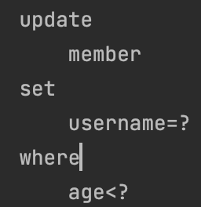

# 중급 문법

## 프로젝션과 결과 반환

- 프로젝션 select 대상 지정

```java
List<String> result = queryFactory
            .select(member.username)
            .from(member)
            .fetch();
```

- 프로젝션 대상이 하나면 타입을 명확하게 지정 가능
- 프로젝션 대상이 둘 이상이면 튜플이나 DTO로 조회

</br>

- 튜플 조회

```java
    @Test
    public void tupleProjection(){

        List<Tuple> result = queryFactory
                .select(member.username, member.age)
                .from(member)
                .fetch();
        for (Tuple tuple : result) {
            String username = tuple.get(member.username);
            Integer age = tuple.get(member.age);
            System.out.println("username=" + username);
            System.out.println("age=" + age);
        }
    }
```

</br>

- tuple도 application layer 밖에서 사용해서는 안된다.
- 하부 구현기술을 그 하위 비즈니스로직에 노출 X

</br>

## 프로젝션관 결과 반환 - DTO 조회

</br>

- 순수 JPA에서 DTO 조회 코드

```java
    @Test
    public void findDtoByJPQL(){
        List<MemberDto> result = em.createQuery(
                        "select new study.querydsl.dto.MemberDto(m.username, m.age) " +
                                "from Member m", MemberDto.class)
                .getResultList();
    }
```

- 순수 JPA에서 DTO를 조회할 때는 new 명령어를 사용해야함
- DTO의 package이름을 다 적어줘야해서 지저분함
- 생성자 방식만 지원함

</br>

### Query 빈 생성(Bean Population)

</br>

- 주의 : QueryDsl은 기본 생성자의 접근 제어자를 public으로 요구한다.

```java
@Data
public class MemberDto {

    private String username;
    private int age;

    public MemberDto(){}

    public MemberDto(String username, int age) {
        this.username = username;
        this.age = age;
    }
}
```

</br>

- 프로퍼티 접근

</br>

```java
    @Test
    public void findDtoBySetter(){
        queryFactory
                .select(Projections.bean(MemberDto.class,
                        member.username,
                        member.age))
                .from(member)
                .fetch();
    }
```

</br>

- 필드 직접 접근

</br>

```java
    @Test
    public void findDtoByField(){
        queryFactory
                .select(Projections.fields(MemberDto.class,
                        member.username,
                        member.age))
                .from(member)
                .fetch();
    }
```

</br>

> 프로퍼티 접근과, 생성자 접근의 영향을 받지 않고,  
> 직접 필드에 값을 매핑, 아마도 리플렉션으로 클래스타입 추론하는 듯

</br>

- 생성자 사용

```java
    @Test
    public void findByConstructor(){
        queryFactory
                .select(Projections.constructor(MemberDto.class,
                        member.username,
                        member.age))
                .from(member)
                .fetch();
    }
```

</br>

- 별칭이 다를 때

```java
    @Test
    void findUserDto() {
        List<UserDto> result = queryFactory
                .select(Projections.fields(UserDto.class,
                        member.username,
                        member.age))
                .from(member)
                .fetch();

        result.forEach(System.out::println);
    }
```

</br>

> 이름이 null로 들어간다

</br>

- alias 지정

```java
    @Test
    void findUserDto() {
        List<UserDto> result = queryFactory
                .select(Projections.fields(UserDto.class,
                        member.username.as(name),
                        member.age))
                .from(member)
                .fetch();

        result.forEach(System.out::println);
    }
```

- 서브 쿼리

```java
    @Test
    void findUserDto() {
        QMember memberSub = new QMember("memberSub");
        List<UserDto> result = queryFactory
                .select(Projections.fields(UserDto.class,
                        member.username.as("name"),

                        ExpressionUtils.as(JPAExpressions
                                .select(memberSub.age.max())
                                .from(memberSub), "age")
                ))
                .from(member)
                .fetch();

        result.forEach(System.out::println);
    }
```

</br>

## 프로젝션과 결과 반환 - @QueryProejction

```java
@Data
public class MemberDto {

    private String username;
    private int age;

    public MemberDto(){}

    @QueryProjection
    public MemberDto(String username, int age) {
        this.username = username;
        this.age = age;
    }
}
```

</br>

> 어노테이션을 붙이고 complieQueryDsl을 실행시키면

</br>

|컴파일|
||

</br>

```java
    @Test
    public void findDtoByQueryProjection() {
        queryFactory
                .select(new QMemberDto(member.username, member.age))
                .from(member)
                .fetch();
    }
```

> QMemberDto의 생성자 정보를 확인한다.  
> `컴파일 타입에 타입이 맞는지 확인`하고  
> 실행시킬 수 있다.

</br>

- 하지만 DTO에 QueryDSL 어노테이션을 유지해야하는 점과
- `DTO가 QueryDSL 의존적이다.`
- DTO까지 Q파일을 생성해야하는 단점이 있다.

</br>

```java
List<String> result = queryFactory
            .select(member.username).distinct()
            .from(member)
            .fetch();
```

</br>

## 동적 쿼리 - BooleanBuilder 사용

</br>

```java
    private List<Member> searchMember1(String usernameCond, Integer ageCond) {

        BooleanBuilder builder = new BooleanBuilder();
        if (usernameCond != null) {
            builder.and(member.username.eq(usernameCond));
        }

        if (ageCond != null) {
            builder.and(member.age.eq(ageCond));
        }

        return queryFactory
                .selectFrom(member)
                .where(builder)
                .fetch();
    }
```

</br>

```java
    @Test
    public void dynamicQuery_BooleanBuilder() {
        String usernameParam = "member1";
        Integer ageParam = 10;

        List<Member> result = searchMember1(usernameParam, ageParam);
        assertThat(result.size()).isEqualTo(1);
    }
```

</br>

|                 동적 쿼리 결과                  |
| :---------------------------------------------: |
|  |

</br>

> BooleanBuilder를 통해 동적 쿼리가 실행 되는 것을 확인할 수 있다.

</br>

## 동적 쿼리 - Where 다중 파라미터 사용

</br>

```java
    @Test
    public void 동적쿼리_WhereParam() {
        String usernameParam = "member1";
        Integer ageParam = 10;

        List<Member> result = searchMember2(usernameParam, ageParam);
        assertThat(result.size()).isEqualTo(1);
    }

    private List<Member> searchMember2(String usernameCond, Integer ageCond) {
        return queryFactory
                .selectFrom(member)
                .where(usernameEq(usernameCond), ageEq(ageCond))
                .fetch();
    }

    private BooleanExpression usernameEq(String usernameCond) {
        return usernameCond != null ? member.username.eq(usernameCond) : null;
    }

    private BooleanExpression ageEq(Integer ageCond) {
        return ageCond != null ? member.age.eq(ageCond) : null;
    }
```

</br>

- 조합기능을 통해 처리

```java
    @Test
    public void 동적쿼리_WhereParam() {
        String usernameParam = "member1";
        Integer ageParam = 10;

        List<Member> result = searchMember2(usernameParam, ageParam);
        assertThat(result.size()).isEqualTo(1);
    }

    private List<Member> searchMember2(String usernameCond, Integer ageCond) {
        return queryFactory
                .selectFrom(member)
                .where(allEq(usernameCond, ageCond))
                .fetch();
    }

    private BooleanExpression allEq(String usernameCond, Integer ageCond) {
        return usernameEq(usernameCond).and(ageEq(ageCond));
    }
```

</br>

> 아 나 이번 프로젝트 할 때 검색 조건 처리할 거 많은데!

</br>

## 수정, 삭제 벌크 연산

</br>

- 쿼리 한 번으로 대량 데이터 수정

</br>

```java

```

</br>

- 28살 미만인 회원의 이름을 비회원으로 설정

</br>

```java
    @Test
    @Commit
    public void bulkUpdate(){
        // 28살 미만인 회원의 이름을 비회원으로 설정
        queryFactory.update(member)
                .set(member.username, "비회원")
                .where(member.age.lt(28))
                .execute();
    }
```

</br>

|                   bulk update                    |
| :----------------------------------------------: |
|  |

</br>

|                 h2 console                  |
| :-----------------------------------------: |
|  |

</br>

> bulk 연산은 쿼리가 날아간 이후,  
> 영속성 컨텍스트는 그대로 남아있고 쿼리가 날아간다.  
> repeatable read 발생..  
> 즉 em.flush() 이후 `em.clear()`를 실행시켜야한다.

</br>

- 기존 숫자에 1 더하기

</br>

```java
long count = queryFactory
        .update(member)
        .set(member.age, member.age.add(1))
        .execute();
```

</br>

- 곱하기 : multiply(x)
- 빼기 : substract(x)
- 나누기 : divide(x)

</br>

- 쿼리 한 번으로 대량 데이터 삭제

</br>

```java
long count = queryFactory
            .delete(member)
            .where(member.age.gt(18))
            .execute();
```

</br>

## SQL function 호출 하기

</br>

- SQL function은 JPA와 같이 Dialect에 등록된 내용만 호출할 수 있다.

</br>

- 이름을 member -> M으로 변경하는 replace 함수 사용

```java
    @Test
    public void sqlFunction(){
        List<String> result = queryFactory
                .select(Expressions.stringTemplate("function('replace', {0}, {1}, {2})",
                        member.username, "member", "M"))
                .from(member)
                .fetch();
    }
```

</br>

|                쿼리 결과                 |
| :--------------------------------------: |
|  |

</br>

- 소문자로 변경

```java
    .select(member.username)
    .from(member)
    .where(member.username.eq(Expressions.stringTemplate("function('lower', {0})",
    member.username)))


    .where(member.username.eq(member.username.lower()))
```

</br>

> lower 같은 ansi 표준 함수들은 querydsl이 상당 부분 내장하여  
> 위의 두 결과는 같다.

</br>
