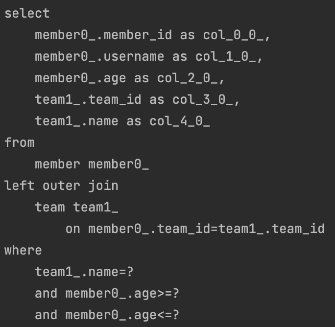

# 실무 활용 - 순수 JPA와 Querydsl

</br>

## 순수 JPA 레포지토리와 QueryDsl

</br>

```java
@Repository
public class MemberJpaRepository {

    private final EntityManager em;
    private final JPAQueryFactory queryFactory;

    public MemberJpaRepository(EntityManager em) {
        this.em = em;
        this.queryFactory = new JPAQueryFactory(em);
    }

    public void save(Member member) {
        em.persist(member);
    }

    public Optional<Member> findById(Long id) {
        Member findMember = em.find(Member.class, id);
        return Optional.ofNullable(findMember);
    }

    public List<Member> findAll() {
        return em.createQuery("select m from Member m", Member.class)
                .getResultList();
    }

    public List<Member> findByUsername(String username) {
        return em.createQuery("select m from Member m where m.username = :username", Member.class)
                .setParameter("username", username)
                .getResultList();
    }

    public List<Member> findAll_Querydsl() {
        return queryFactory
                .selectFrom(member).fetch();
    }
    public List<Member> findByUsername_Querydsl(String username) {
        return queryFactory
                .selectFrom(member)
                .where(member.username.eq(username))
                .fetch();
    }
}
```

</br>

```java

    @Test
    public void basicQuerydslTest() {
        Member member = new Member("member1", 10, null);
        memberJpaRepository.save(member);

        Member findMember = memberJpaRepository.findById(member.getId()).get();
        assertThat(findMember).isEqualTo(member);
        List<Member> result1 = memberJpaRepository.findAll_Querydsl();
        assertThat(result1).containsExactly(member);
        List<Member> result2 =
                memberJpaRepository.findByUsername_Querydsl("member1");
        assertThat(result2).containsExactly(member);
    }

```

</br>

- JPQQueryFactory 스프링 빈 등록

```java
    @Bean
    JPAQueryFactory jpaQueryFactory(EntityManager em) {
      return new JPAQueryFactory(em);
    }
```

</br>

- 동시성 문제를 고려하지 않아도 되는 이유

> 스프링이 주입해주는 엔티티 매니저는 실제 runtime에서  
> 진짜 엔티티 매니저를 찾아주는 프록시용 가짜 엔티티 매니저이다.  
> 가짜 엔티티 매니저는 실제 사용 시점에 트랜잭션 단위로 실제 엔티티 매니저를 할당해준다.
> `자바 ORM 표준 JPA 13.1 참고`

</br>

## 동적 쿼리와 성능 최적화 조회 Builder사용

</br>

- MemberTeamDto

```java
@Data
public class MemberTeamDto {
    private Long memberId;
    private String username;
    private int age;
    private Long teamId;
    private String teamName;

    @QueryProjection
    public MemberTeamDto(Long memberId, String username, int age, Long teamId,
                         String teamName) {
        this.memberId = memberId;
        this.username = username;
        this.age = age;
        this.teamId = teamId;
        this.teamName = teamName;
    }
}
```

```java
@Data
public class MemberSearchCondition {
    private String username;
    private String teamName;
    private Integer ageGoe;
    private Integer ageLoe;
}
```

> `MemberSearchCondition`을 통해 동적쿼리를 생성하여,  
> Member와 Team의 정보를 불러오는 MemberTeamDto를 불러오려고 한다.

</br>

```java
    //Builder 사용
    //회원명, 팀명, 나이(ageGoe, ageLoe)
    public List<MemberTeamDto> searchByBuilder(MemberSearchCondition condition) {
        BooleanBuilder builder = new BooleanBuilder();
        if (hasText(condition.getUsername())) {
            builder.and(member.username.eq(condition.getUsername()));
        }
        if (hasText(condition.getTeamName())) {
            builder.and(team.name.eq(condition.getTeamName()));
        }
        if (condition.getAgeGoe() != null) {
            builder.and(member.age.goe(condition.getAgeGoe()));
        }
        if (condition.getAgeLoe() != null) {
            builder.and(member.age.loe(condition.getAgeLoe()));
        }
        return queryFactory
                .select(new QMemberTeamDto(
                        member.id,
                        member.username,
                        member.age,
                        team.id,
                        team.name))
                .from(member)
                .leftJoin(member.team, team)
                .where(builder)
                .fetch();
    }
```

</br>

> 동적쿼리를 세팅한 후에, member와 team의 fetch join을 통해 한 방 쿼리를 실행하도록 작성

</br>

```java
    @Test
    public void searchTest() {
        Team teamA = new Team("teamA");
        Team teamB = new Team("teamB");

        em.persist(teamA);
        em.persist(teamB);

        Member member1 = new Member("member1", 10, teamA);
        Member member2 = new Member("member2", 20, teamA);
        Member member3 = new Member("member3", 30, teamB);
        Member member4 = new Member("member4", 40, teamB);

        em.persist(member1);
        em.persist(member2);
        em.persist(member3);
        em.persist(member4);

        MemberSearchCondition condition = new MemberSearchCondition();
        condition.setAgeGoe(35);
        condition.setAgeLoe(40);
        condition.setTeamName("teamB");

        List<MemberTeamDto> result =
                memberJpaRepository.searchByBuilder(condition);

        assertThat(result).extracting("username").containsExactly("member4");
    }
```

</br>

|             테스트 결과              |
| :----------------------------------: |
|  |

</br>

> 조건이 잘 설정 되어있는지 확인해야한다.  
> 모든 데이터를 불러오기 때문에 위험!

</br>

## 동적 쿼리와 성능 최적화 조회 Where절 파라미터 사용

</br>

```java
    public List<MemberTeamDto> search(MemberSearchCondition condition) {
        return queryFactory
                .select(new QMemberTeamDto(
                        member.id,
                        member.username,
                        member.age,
                        team.id,
                        team.name))
                .from(member)
                .leftJoin(member.team, team)
                .where(usernameEq(condition.getUsername()),
                        teamNameEq(condition.getTeamName()),
                        ageGoe(condition.getAgeGoe()),
                        ageLoe(condition.getAgeLoe()))
                .fetch();
    }

    private BooleanExpression usernameEq(String username) {
        return isEmpty(username) ? null : member.username.eq(username);
    }

    private BooleanExpression teamNameEq(String teamName) {
        return isEmpty(teamName) ? null : team.name.eq(teamName);
    }

    private BooleanExpression ageGoe(Integer ageGoe) {
        return ageGoe == null ? null : member.age.goe(ageGoe);
    }

    private BooleanExpression ageLoe(Integer ageLoe) {
        return ageLoe == null ? null : member.age.loe(ageLoe);
    }
```

</br>

> Where Parameter는 조건을 여러 메서드에서 재사용하는 것이 가능하다.

</br>

## 조회 API 컨트롤러 개발

```java
@RestController
@RequiredArgsConstructor
public class MemberController {

    private final MemberJpaRepository memberJpaRepository;

    @GetMapping("/v1/members")
    public List<MemberTeamDto> searchMemberV1(MemberSearchCondition condition){
        return memberJpaRepository.search(condition);
    }
}
```

</br>

- 조회를 위한 데이터 추가

```java
@Profile("local")
@Component
@RequiredArgsConstructor
public class InitMember {

    private final InitMemberService initMemberService;

    @PostConstruct
    public void init(){
        initMemberService.init();
    }

    static class InitMemberService{

        @PersistenceContext
        EntityManager em;

        @Transactional
        public void init(){
            Team teamA = new Team("teamA");
            Team teamB = new Team("teamB");

            em.persist(teamA);
            em.persist(teamB);

            for (int i = 0; i < 100; i++) {
                Team selectedTeam = i % 2 == 0 ? teamA : teamB;
                em.persist(new Member("member" + i, i, selectedTeam));
            }
        }
    }
}
```

</br>

- http://localhost:8080/v1/members?teamName=teamB&ageGoe=31&ageLoe=35 결과 확인 하기
