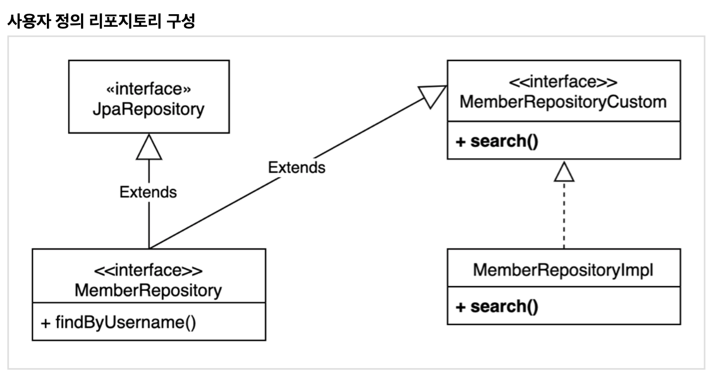
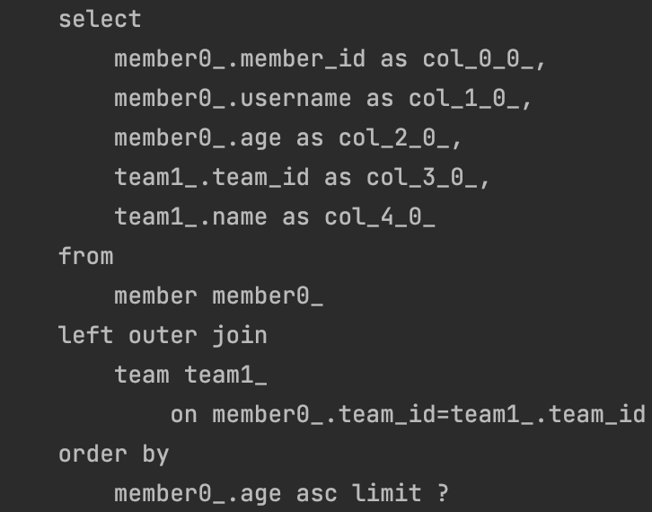
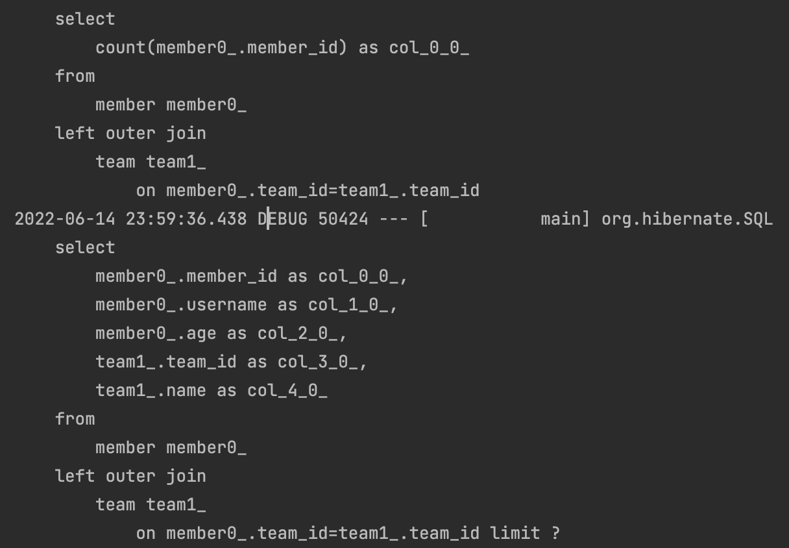
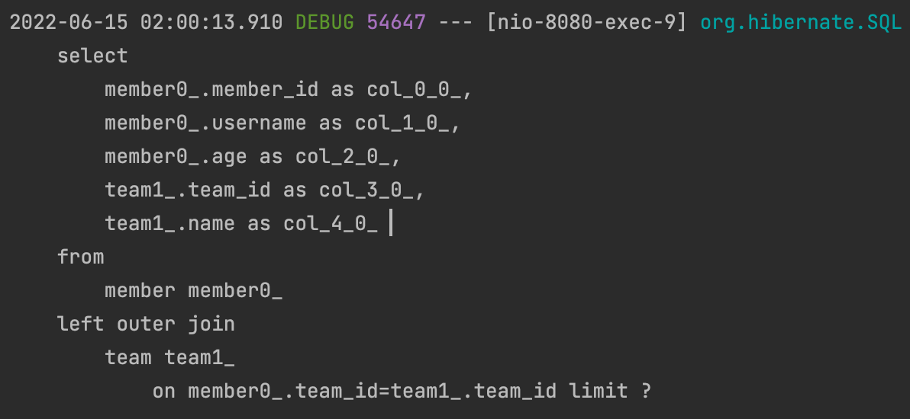

# 실무 활용 - 스프링 데이터 JPA와 QueryDsl

</br>

## 스프링 데이터 JPA 리포지토리로 변경

</br>

## 사용자 정의 리포지토리

</br>

- 사용자 정의 리포지토리 사용법
- 사용자 정의 인터페이스 구현
- 스프링 데이터 리포지토리에 사용자 정의 인터페이스 상속

</br>

|                 사용자 정의 레포지토리                 |
| :----------------------------------------------------: |
|  |

</br>

> MemberRepository가 JPARepository와 MemberRepositoryCustom을 상속 받음  
> 내가 직접 필요한 기능들을 MemberRepositoryImple에서 구현

</br>

- Custom Interface

```java
public interface MemberRepositoryCustom {

  List<MemberTeamDto> search(MemberSearchCondition condition);
}
```

- 실제 구현체

```java
public class MemberRepositoryImpl implements MemberRepositoryCustom {

  private final JPAQueryFactory queryFactory;

  public MemberRepositoryImpl(EntityManager em) {
    this.queryFactory = new JPAQueryFactory(em);
  }

  @Override
  public List<MemberTeamDto> search(MemberSearchCondition condition) {
    return queryFactory
        .select(new QMemberTeamDto(
            member.id,
            member.username,
            member.age,
            team.id,
            team.name))
        .from(member)
        .leftJoin(member.team, team)
        .where(usernameEq(condition.getUsername()),
            teamNameEq(condition.getTeamName()),
            ageGoe(condition.getAgeGoe()),
            ageLoe(condition.getAgeLoe()))
        .fetch();
  }

  private BooleanExpression usernameEq(String username) {
    return isEmpty(username) ? null : member.username.eq(username);
  }

  private BooleanExpression teamNameEq(String teamName) {
    return isEmpty(teamName) ? null : team.name.eq(teamName);
  }

  private BooleanExpression ageGoe(Integer ageGoe) {
    return ageGoe == null ? null : member.age.goe(ageGoe);
  }

  private BooleanExpression ageLoe(Integer ageLoe) {
    return ageLoe == null ? null : member.age.loe(ageLoe);
  }
}
```

</br>

- 마지막으로 Custom 인터페이스도 상속 받기.

```java
public interface MemberRepository extends JpaRepository<Member, Long>, MemberRepositoryCustom {

  List<Member> findByUsername(String username);
}
```

</br>

- 그런데 현재 search 함수에서 조회 조건이 대략 네 개 정도 들어가는 `Api 종속 적인 쿼리`
  - `Entity가 아닌 특정 요청을 중요시하는 쿼리 집합을 상속`받아서 사용하는 것이 맞나?

</br>

- MemberQueryRepository

```java
@Repository
public class MemberQueryRepository {

  private final JPAQueryFactory queryFactory;

  public MemberQueryRepository(EntityManager em) {
    this.queryFactory = new JPAQueryFactory(em);
  }

  public List<MemberTeamDto> search(MemberSearchCondition condition) {
    return queryFactory
        .select(new QMemberTeamDto(
            member.id,
            member.username,
            member.age,
            team.id,
            team.name))
        .from(member)
        .leftJoin(member.team, team)
        .where(usernameEq(condition.getUsername()),
            teamNameEq(condition.getTeamName()),
            ageGoe(condition.getAgeGoe()),
            ageLoe(condition.getAgeLoe()))
        .fetch();
  }

  private BooleanExpression usernameEq(String username) {
    return isEmpty(username) ? null : member.username.eq(username);
  }

  private BooleanExpression teamNameEq(String teamName) {
    return isEmpty(teamName) ? null : team.name.eq(teamName);
  }

  private BooleanExpression ageGoe(Integer ageGoe) {
    return ageGoe == null ? null : member.age.goe(ageGoe);
  }

  private BooleanExpression ageLoe(Integer ageLoe) {
    return ageLoe == null ? null : member.age.loe(ageLoe);
  }

}
```

</br>

```java
public interface MemberRepository extends JpaRepository<Member, Long> {

  List<Member> findByUsername(String username);
}
```

</br>

> 사용자 정의에 집착한 설계보다,  
> 각 인터페이스와 클래스의 역할에 대해 고민하고 나누는 것도 좋은 방법일 것같다.

- `실제로 대부분 뷰에서 테이블 join 날려서 한 번에 뿌려야 하는 경우..`
  - Entity들을 가져와서 조합하기 전에 그냥 Dto로 뽑아오는 전략도 고려
  - 화면에 맞춘 api 요청이기때문에 애시당초 재사용성을 고려하기는 어려울 것같다.

</br>

### 사용자 정의 리포지토리 정리

- `기본은 커스텀을 사용하는 것이 맞다.`
- 그래도 프로젝트가 너무 커지고 아키텍처적으로 유연하게 가져가고 싶다.
  - `조회용 화면에 맞게 분리해내는 방법도 좋은 방법이다.`

</br>

## 스프링 데이터 페이징 활용 1 - QueryDsl 페이징 연동

</br>

PageRequest 알아보기
fetchResults 5.0부터 대체 어떻게 해결할 건데
order by는 total count 쿼리와 관련이 없다
total count에서는 order by 들어 간 것을 다 지운다

</br>

- 전체 카운트를 한 번에 조회하는 단순한 방법

```java
  @Override
  public Page<MemberTeamDto> searchPageSimple(MemberSearchCondition condition, Pageable pageable) {
    QueryResults<MemberTeamDto> results = queryFactory
        .select(new QMemberTeamDto(
            member.id,
            member.username,
            member.age,
            team.id,
            team.name))
        .from(member)
        .leftJoin(member.team, team)
        .where(usernameEq(condition.getUsername()),
            teamNameEq(condition.getTeamName()),
            ageGoe(condition.getAgeGoe()),
            ageLoe(condition.getAgeLoe()))
        .offset(pageable.getOffset())
        .limit(pageable.getPageSize())
        .fetchResults();

    List<MemberTeamDto> content = results.getResults();
    long total = results.getTotal();

    return new PageImpl<>(content, pageable, total);
  }

```

</br>

- fetchResults()에서 order by는 total count와 관련이 없어서 다 지운다?

</br>

> 그러니까 count는 단순히 data row를 counting하는 것이기 때문에,  
> 굳이 order by 연산을 실행시키지 않아도 결과에 지장이없다.  
> 따라서 fetchResults()에서 실행되는 count 쿼리에서는  
> `order by 연산을 지워준다!`

</br>

|          order by 지워지는지 확인          |
| :----------------------------------------: |
|  |

</br>

> 결과 다시 확인 해보면,  
> count 쿼리에는 `order by가 없고`,  
> 페이징 조회하는 쿼리에서는 `order by연산이 실행되는 것`을 알 수 있다.

</br>

- 데이터 내용과 전체 카운트를 별도로 조회하는 방법

```java
  @Override
  public Page<MemberTeamDto> searchPageComplex(MemberSearchCondition condition, Pageable pageable) {
    // content query
    List<MemberTeamDto> content = queryFactory
        .select(new QMemberTeamDto(
            member.id,
            member.username,
            member.age,
            team.id,
            team.name))
        .from(member)
        .leftJoin(member.team, team)
        .where(usernameEq(condition.getUsername()),
            teamNameEq(condition.getTeamName()),
            ageGoe(condition.getAgeGoe()),
            ageLoe(condition.getAgeLoe()))
        .offset(pageable.getOffset())
        .limit(pageable.getPageSize())
        .fetch();

    // total count query
    long total = queryFactory
        .select(member)
        .from(member)
        .where(usernameEq(condition.getUsername()),
            teamNameEq(condition.getTeamName()),
            ageGoe(condition.getAgeGoe()),
            ageLoe(condition.getAgeLoe()))
        .fetchCount();

    return new PageImpl<>(content, pageable, total);
  }
```

- query를 이렇게 분리하는 이유

</br>

|     searchPageSimple 메서드 결과 쿼리     |
| :---------------------------------------: |
|  |

</br>

> 자세히 보면 count 쿼리를 직접 커스텀 최적화하지 않고,  
> fetchResults() 메서드에 의존하여, 쿼리를 실행시켜  
> `count 쿼리시 member와 team간의 left join이 발생시키는 것`을 알 수 있다.
>
> 결과는 같지만 사실 잘 생각해보면 condition에 충족하는 멤버만  
> counting 하면 될 문제!

</br>

### QueryDsl 페이징 연동 1 정리

</br>

> 전체 카운트 조회 뿐만 아니라, 쿼리가 말려 있다면  
> `불필요한 조인 쿼리가 실행되는지 체크 해볼 것`  
> `또한 코드와 쿼리 리팩토링을 성능의 문제가 없다면 보다 더 유지보수 하기 좋게 개선할 것`

</br>

- 의미 없이 데이터 얼마 없으면 그냥 쓰라하시네...

</br>

## 스프링 데이터 페이징 활용 2 - CountQuery 최적화

</br>

- 스프링 데이터 라이브러리가 제공하는 것을 사용
- `count 쿼리가 필요없다면 굳이 쿼리를 날릴 필요가 없다!`
  - 1. 페이지 시작이면서 contents 사이즈가 페이지 사이즈보다 작을때
  - 2. 마지막 페이지 일 때 (offset + 컨텐츠 사이즈를 더해서 전체 사이즈 구하기)

</br>

- case 1.
  - 즉 offset이 0번(`JPA가 지원하는 Pageable 사용시!`)
  - size를 10을 요구했으나 실제 테이블에 들어있는 데이터가 10보다 작다고 가정하면.
  - 현재 페이지의 사이즈를 알고 있으니 `total count 쿼리가 불필요하다.`
- case 2.
  - 즉 offset 5(6번째 행부터), size가 5일 때, 마지막 페이지라면
  - last page면서 contents size가 5라면
  - offset + contents size = `total size = 10`이다.

</br>

```java
  @Override
  public Page<MemberTeamDto> searchPageComplex(MemberSearchCondition condition, Pageable pageable) {
    List<MemberTeamDto> content = queryFactory
        .select(new QMemberTeamDto(
            member.id,
            member.username,
            member.age,
            team.id,
            team.name))
        .from(member)
        .leftJoin(member.team, team)
        .where(usernameEq(condition.getUsername()),
            teamNameEq(condition.getTeamName()),
            ageGoe(condition.getAgeGoe()),
            ageLoe(condition.getAgeLoe()))
        .offset(pageable.getOffset())
        .limit(pageable.getPageSize())
        .fetch();

    JPAQuery<Member> contentQuery = queryFactory
        .select(member)
        .from(member)
        .where(usernameEq(condition.getUsername()),
            teamNameEq(condition.getTeamName()),
            ageGoe(condition.getAgeGoe()),
            ageLoe(condition.getAgeLoe())
        );

    // 위의 명시한 두 가지 중 하나를 충족하면 count Query를 실행하지 않는다.
    return PageableExecutionUtils.getPage(content, pageable, contentQuery::fetchCount);
//    return new PageImpl<>(content, pageable, total);
  }
```

</br>

- total Count를 실행시켜 가져오는 것이아니라,
- countQuery를 만든 후에,
- PagebleExecutionUtils.getPage()에 content, pageable 정보를 넘겨준 후,
- 위의 case 1. , case 2.에 만족하지 않으면 count Query가 실행 되지 않는다.

</br>

- getPage() 함수

```java
import java.util.List;
import java.util.function.LongSupplier;

import org.springframework.data.domain.Page;
import org.springframework.data.domain.PageImpl;
import org.springframework.data.domain.Pageable;
import org.springframework.util.Assert;

/**
 * Support for query execution using {@link Pageable}. Using {@link PageableExecutionUtils} assumes that data queries
 * are cheaper than {@code COUNT} queries and so some cases can take advantage of optimizations.
 *
 * @author Mark Paluch
 * @author Oliver Gierke
 * @author Christoph Strobl
 * @author Jens Schauder
 * @since 2.4
 */
public abstract class PageableExecutionUtils {

	private PageableExecutionUtils() {}

	/**
	 * Constructs a {@link Page} based on the given {@code content}, {@link Pageable} and {@link LongSupplier} applying
	 * optimizations. The construction of {@link Page} omits a count query if the total can be determined based on the
	 * result size and {@link Pageable}.
	 *
	 * @param content result of a query with applied {@link Pageable}. The list must not be {@literal null} and must
	 *          contain up to {@link Pageable#getPageSize()} items.
	 * @param pageable must not be {@literal null}.
	 * @param totalSupplier must not be {@literal null}.
	 * @return the {@link Page} for {@link List content} and a total size.
	 */
	public static <T> Page<T> getPage(List<T> content, Pageable pageable, LongSupplier totalSupplier) {

		Assert.notNull(content, "Content must not be null!");
		Assert.notNull(pageable, "Pageable must not be null!");
		Assert.notNull(totalSupplier, "TotalSupplier must not be null!");

    // case 1.
		if (pageable.isUnpaged() || pageable.getOffset() == 0) {

			if (pageable.isUnpaged() || pageable.getPageSize() > content.size()) {
				return new PageImpl<>(content, pageable, content.size());
			}

			return new PageImpl<>(content, pageable, totalSupplier.getAsLong());
		}

    // case 2. content 사이즈가 0이 아니면서 page size가 더 클 경우 offset + content size를 내보내준다.
		if (content.size() != 0 && pageable.getPageSize() > content.size()) {
			return new PageImpl<>(content, pageable, pageable.getOffset() + content.size());
		}

    // 위의 두 가지 조건을 만족하지 못하면, supplier에서 값을 가져와 쿼리 실행
		return new PageImpl<>(content, pageable, totalSupplier.getAsLong());
	}
}

```

- 주석 확인

</br>

## 스프링 데이터 페이징 활용 3 - 컨트롤러 개발

- 이제 위의 만든 것들을 api로 확인 해보기

</br>

```java
@Profile("local")
@Component
@RequiredArgsConstructor
public class InitMember {

  private final InitMemberService initMemberService;

  @PostConstruct
  public void init() {
    initMemberService.init();
  }

  @Component
  static class InitMemberService {

    @PersistenceContext
    EntityManager em;

    @Transactional
    public void init() {
      Team teamA = new Team("teamA");
      Team teamB = new Team("teamB");

      em.persist(teamA);
      em.persist(teamB);

      for (int i = 0; i < 100; i++) {
        Team selectedTeam = i % 2 == 0 ? teamA : teamB;
        em.persist(new Member("member" + i, i, selectedTeam));
      }
    }
  }
}
```

</br>

```java
    @GetMapping("/v3/members")
    public Page<MemberTeamDto> searchMemberV3(MemberSearchCondition condition, Pageable pageable) {
        return memberRepository.searchPageComplex(condition, pageable);
    }
```

</br>

> 현재 멤버 100개 있고 searchPageComplex만 확인 할 것,  
> `Count Query 날아가는지 확인`

</br>

- http://localhost:8080/v3/members?page=0&size=110
  - 첫번째 페이지면서
  - size 110 > total contents보다 큰 경우

|               api 쿼리 확인 1               |
| :-----------------------------------------: |
|  |

> count 쿼리가 실행되지 않은 것을 확인 할 수 있다.

</br>

- http://localhost:8080/v3/members?page=4&size=22
  - page가 4 즉 5번째 페이지면서
  - size가 22면

> 마지막 5번째 페이지의 content size는 12이다.  
> 마지막 페이지이면서, content size가 page size보다 작음으로  
> count 쿼리가 나가지 않는다.

</br>

### 스프링 데이터 정렬

</br>

> 스프링 데이터 JPA의 정렬을 QueryDsl의 정렬(OrderSpecifier)로 편리하게 변경하는 기능 제공

</br>

- 스프링 데이터 Sort를 QueryDsl의 OrderSpecifier로 변환

</br>

```java
JPAQuery<Member> query = queryFactory
            .selectFrom(member);
    for (Sort.Order o : pageable.getSort()) {
        PathBuilder pathBuilder = new PathBuilder(member.getType(),
    member.getMetadata());
        query.orderBy(new OrderSpecifier(o.isAscending() ? Order.ASC : Order.DESC,
                pathBuilder.get(o.getProperty())));
    List<Member> result = query.fetch();

```

> 간단한 Entity에서 동작하고  
> Join 연산시 제대로 동작하지 않는다.  
> 뒷 부분 수업 내용 난감하면 직접 테스팅 날려보기

</br>
